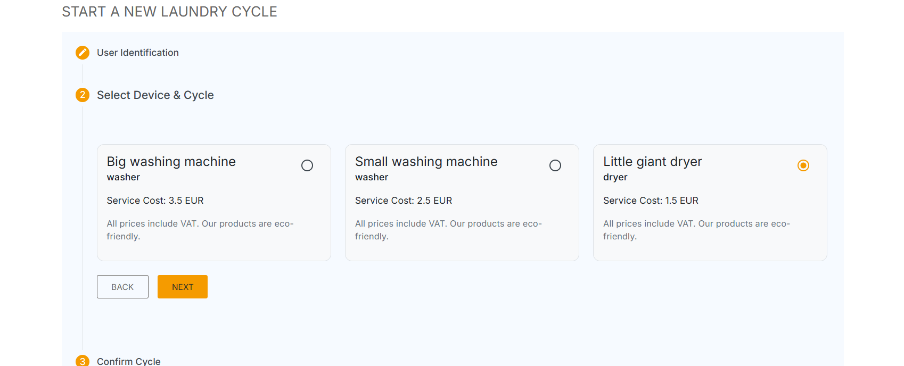

# Miele Launderette

Premium laundry services with professional-grade equipment — an Angular application created for the FE Assessment task.
Users can start and track laundry cycles in real-time while interacting with a mock backend API.

## Tech Stack
| Layer     | Technology                       |
|----------|-----------------------------------|
| Frontend | Angular, TypeScript, RxJS, SCSS   |
| Backend  | JSON Server (Mock)                |
| UI       | Angular Material components       |
| Testing  | Jasmine + Karma (✅ Unit Tests)   |

## Installation & Setup

### 1️⃣ Install dependencies
```bash
npm install
```

### 2️⃣ Start the backend API (Terminal #1)
```bash
json-server ./backend-api.json --watch
```
Backend runs at: [http://localhost:3000](http://localhost:3000)

### 3️⃣ Start Angular app (Terminal #2)
```bash
ng serve
```
Frontend opens at: [http://localhost:4200/](http://localhost:4200/)

## Application Overview

### User Journey Breakdown (Screenshots Included)
1️⃣ Landing Page — Start or Monitor a Laundry Cycle


2️⃣ Start New Cycle — Step 1: User Identification
(Optional — autocomplete from previous users)


3️⃣ Start New Cycle — Step 2: Select Device & Cycle
(Device list dynamically shows pricing & availability)


4️⃣ Start New Cycle — Step 3: Confirm Cycle
(Review selections before starting)


5️⃣ On Create → Redirect to Active Cycles + Success Snackbar


6️⃣ Cycles List — Filter by Active, History, All
(With Invoice Modal Preview)


## Features & Functionality

✔ Real-time cycle management
✔ 3-step guided workflow to create cycles
✔ Invoice breakdown modal
✔ Responsive UI aligned with Miele MOVE styling
✔ Unknown user auto-handling
✔ Tabs to sort cycles by status
✔ Snackbar success feedback
✔ Unit tests implemented

## Manage Laundry Cycles

| Tab    | Purpose                      |
|--------|------------------------------|
| Active | Shows in-progress cycles     |
| History| Completed, cancelled, failed |
| All    | Complete record of all cycles|

Each cycle card displays:
- Status & timestamps
- Device + Tariff info
- User
- Price incl. VAT

## API Endpoints Used

| Method | Endpoint    | Purpose           |
|--------|-------------|-------------------|
| GET    | /cycles     | Fetch cycles      |
| GET    | /devices    | Load devices      |
| GET    | /tariffs    | Retrieve pricing  |
| POST   | /cycles     | Create new cycle  |

JSON Server automatically persists changes.

## Testing

To execute unit tests:
```bash
ng test
```
✔ Ensures app stability & protects key flow regressions

## Additional Notes

- Project aligned with all FE Assessment requirements
- Mock backend (no real hardware integration)
- Clean component structure & scalable architecture

## Author

Developed by Adrian Comanescu
Front-End Developer
